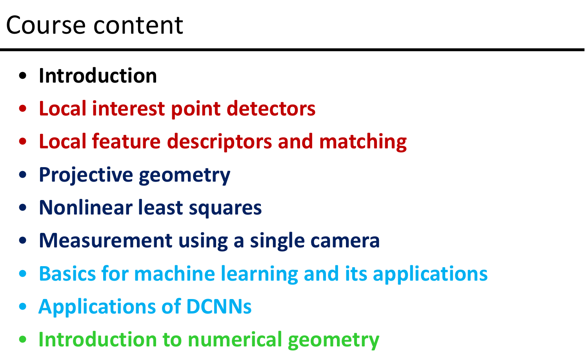

视觉起源

> "The plain man's answer (and Aristotle's too) would be, to know what is where by looking.In other words, vision is the process of discovering from images what is present in the world, and where it is David Marr, Vision : A Computational Investigation into the Human Representation and Processing of Visual Information, 1982

MVS : Multiple View Stereo 多视角立体

**劳伦斯·罗伯茨**

- In 1963, Lawrence Roberts, a PhD student at the MIT, completed his thesis "Machine concept of three-dimensional solids" , which is considered as **the first professional thesis in the field of computer vision**; this thesis describes the process of deriving three-dimensional information from two-dimensional images in the ideal block world
- In view of his groundbreaking contribution, Roberts is widely considered as **the father of computer vision**

- CVPR (IEEE International Conference on Computer Vision and Patter
Recognition)was founded in 1983
- ICCV (IEEE International Conference on Computer Vision) was founded in 1987

**Yann LeCun**

- He s a [Turing Award](https://en.wikipedia.org/wiki/Turing_Award "Turing Award") winning French [computer scientist](https://en.wikipedia.org/wiki/Computer_scientist "Computer scientist") working primarily in the fields of [machine learning](https://en.wikipedia.org/wiki/Machine_learning "Machine learning"), [computer vision](https://en.wikipedia.org/wiki/Computer_vision "Computer vision"), [mobile robotics](https://en.wikipedia.org/wiki/Mobile_robotics "Mobile robotics") and [computational neuroscience](https://en.wikipedia.org/wiki/Computational_neuroscience "Computational neuroscience").
- He is well known for his work on [optical character recognition](https://en.wikipedia.org/wiki/Optical_character_recognition "Optical character recognition") and [computer vision](https://en.wikipedia.org/wiki/Computer_vision "Computer vision") using [convolutional neural networks](https://en.wikipedia.org/wiki/Convolutional_neural_network "Convolutional neural network") (CNN), and is a founding father of convolutional nets.

深度学习三巨头：Yoshua Bengio(加拿大), Geoffrey Hinton(加拿大), and Yann LeCun(法国)

|        |           代表            |
| :----: | :-----------------------: |
| 何凯明 | ResNet 港中文CUHK博士毕业 |
| 李飞飞 |    ImageNet ---> 竞赛     |
|  李沐  |   《动手学习深度学习》    |
| 李宏毅 |                           |
| 吴恩达 |                           |
| 周志华 |   南大人工智能学院院长    |

|       | 代表 |
| :---: |: ---------------: |
| Alex Krizhevsky                                                                                       | AlexNet （DNN） |
| Ashish Vaswani, Noam Shazeer, Niki Parmar, Jakob Uszkoreit, Llion Jones, Aidan N. Gome, Łukasz Kaiser | transformer     |
| Ben Mildenhall                                                                                        | Nerf 三维       |

John Daughman 虹膜识别

Inertial Measurement Unit (IMU) 惯性测量单元

物理空间 -> 图像空间 （相似变换 similarity）

Long-term 教了12年

